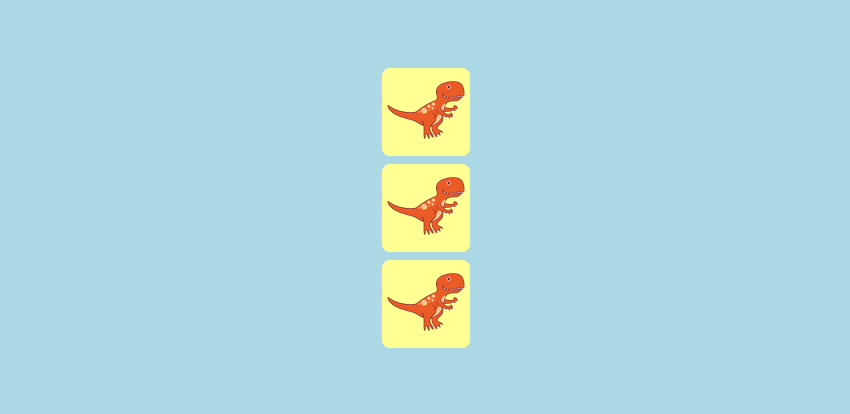

# css-display

## Learning Target
- I am learning how to use the CSS ```display: flex``` property to control how elements are positioned

## Success Criteria
- I can describe the difference in behavior between ```display: block``` and ```display: inline``` elements
- I can set ```display: flex``` on a container element to create a flex container
- I can use ```flex-direction```, ```justify-content```, and ```align-items``` to control how child elements are positioned


## Directions
1. Install Live Server and Go Live to view how the webpage looks with no styling
2. Follow directions below

## Flex Container Properties
```css
container {
    display: flex;
    flex-direction: row | column;
    justify-content: start | end | center | space-around | space-between | space-evenly;
    align-items: start | end | center | stretch;
    flex-wrap: wrap | nowrap;
}
```

## Assignment
1. Open ```assignment.html``` in your browser and ```assignment.css``` in your editor.
2. Set each container selector to have ```display: flex```
3. Add flex properties to each container selector to style them to look like the images. **DO NOT CHANGE ANY OTHER CSS PROPERTIES**

### Container 1


### Container 2


### Container 3


### Container 4


### Container 5


### Container 6
